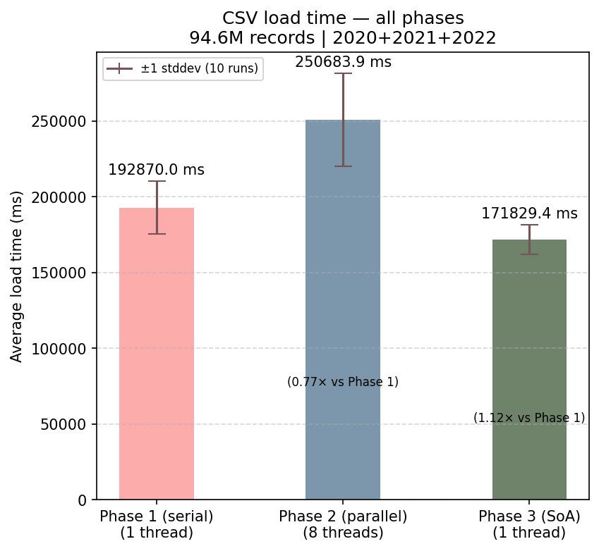
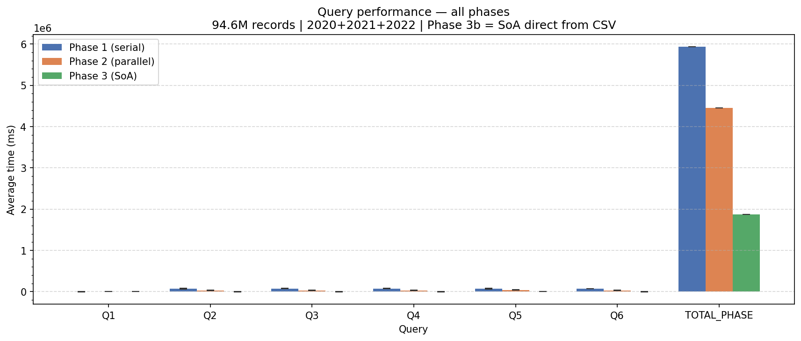
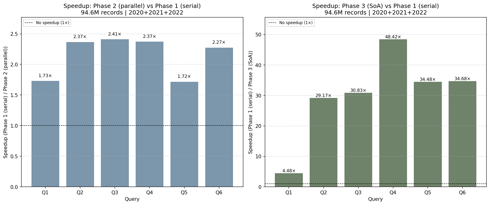
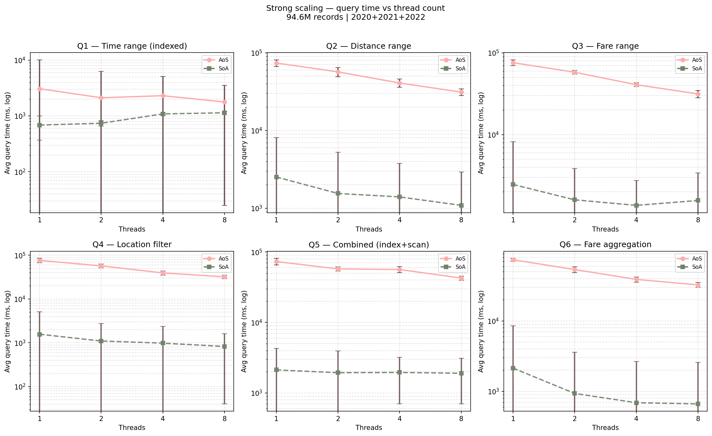
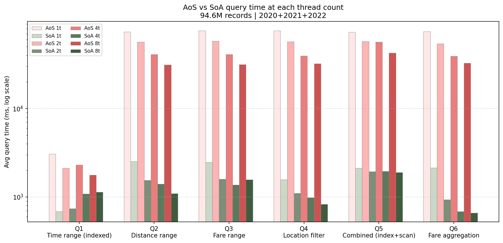

# CMPE-275-mini1 - Memory Overload

**Course**: CMPE 275 - Distributed Application Development <br>
**Focus**: Memory utilization and concurrent processing <br>
**Dataset**: NYC TLC Yellow Taxi Trip Data (2020-2023)

---

## Overview

This project benchmarks three phases of memory-layout strategies for scan-heavy workloads on ~94.6 million taxi trip records (~12 GB CSV):

| Phase    | Strategy                     | Dataset                 | Peak RAM |
| -------- | ---------------------------- | ----------------------- | -------- |
| Phase 1  | AoS serial (baseline)        | 2020+2021+2022 (~94.6M) | ~11.9 GB |
| Phase 2  | AoS parallel (8 threads)     | 2020+2021+2022 (~94.6M) | ~11.9 GB |
| Phase 3a | SoA converted from AoS       | 2023.csv only (~37.9M)  | ~9.7 GB  |
| Phase 3b | SoA loaded directly from CSV | 2020+2021+2022 (~94.6M) | ~11.9 GB |

**Phase 3a is limited to 2023.csv only** because converting AoS->SoA requires both in memory simultaneously (2xN peak = ~23.8 GB for 3 CSVs - exceeds 16 GB RAM). Phase 3b fixes this with a direct CSV->SoA single-pass loader.

---

## Project Structure

```
.
├── CMakeLists.txt
├── include/
│   └── taxi/
│       ├── TripRecord.hpp          # Core data struct (primitive fields only)
│       ├── CsvReader.hpp           # Streaming CSV parser (RFC 4180)
│       ├── DatasetManager.hpp      # AoS loader + QueryEngine facade
│       ├── TripDataSoA.hpp         # SoA layout (17 parallel typed arrays)
│       ├── ParallelLoader.hpp      # Multi-threaded CSV loader for Phase 2
│       ├── BenchmarkRunner.hpp     # Timing harness (N runs, mean/stddev)
│       ├── MetricsRecorder.hpp     # CSV results writer
│       └── SoAQueryEngine.hpp      # Query engine for SoA layout
├── src/
│   ├── CsvReader.cpp
│   ├── DatasetManager.cpp
│   ├── MetricsRecorder.cpp
│   ├── ParallelLoader.cpp
│   ├── SoAQueryEngine.cpp          # Also implements TripDataSoA::from_aos/from_csv
│   └── benchmark_main.cpp          # Main benchmark executable (all 3 phases)
├── scripts/
│   ├── run_benchmark.sh            # Runs all 3 phases (3a+3b), logs to results/
│   ├── run_scaling_benchmark.sh    # Runs strong scaling benchmarks (t=1,2,4,8)
│   ├── download_tlc_data.sh        # Downloads TLC data from NYC OpenData
│   └── validate_build.sh           # Quick build sanity check
├── python/
│   ├── plot_comparison.py          # Generates cross-phase comparison plots
│   └── plot_scaling.py             # Generates strong scaling plots
├── doc/
│   └── REPORT.md                   # Full project report
└── results/
    ├── benchmarks/                 # Benchmark output CSVs and logs
    │   ├── bench_phase1_local.csv
    │   ├── bench_phase2_local.csv
    │   ├── bench_phase3a_local.csv
    │   ├── bench_phase3b_local.csv
    │   ├── bench_local_run.log
    │   └── scaling/               # Strong scaling CSVs (AoS/SoA x t1/t2/t4/t8)
    └── plots/                      # Generated charts
        ├── query_times.png
        ├── speedup.png
        ├── load_time.png
        └── scaling/
            ├── scaling_query_time.png
            ├── scaling_speedup.png
            └── scaling_soa_vs_aos.png
```

---

## Prerequisites

- **CMake** 3.20 or newer
- **C++ Compiler**: GCC 13+ or Clang 16+ (not Apple's Xcode clang)
- **OpenMP** (included with GCC; on macOS: `brew install libomp`)
- **RAM**: 16 GB minimum. Close other large applications before running.
- **Disk**: ~15 GB for data files (gitignored)

---

## Building

```bash
# Configure
cmake -S . -B build -DCMAKE_BUILD_TYPE=Release

# Build the benchmark binary
cmake --build build --target taxi_bench_full

# Verify
ls build/bin/taxi_bench_full
```

---

## Data

Download the NYC TLC Yellow Taxi Trip Data for 2020-2023 from the [NYC Open Data portal](https://data.cityofnewyork.us/browse?q=taxi&sortBy=relevance&pageSize=20):

```bash
bash scripts/download_tlc_data.sh
```

Place the files as:

```
~/Downloads/taxi_data/
    2020.csv    (~3.1 GB)
    2021.csv    (~3.8 GB)
    2022.csv    (~5.1 GB)
    2023.csv    (~4.7 GB)
```

**Do not commit data files** - they are gitignored.

---

## Running Benchmarks

### All 3 Phases

```bash
bash scripts/run_benchmark.sh [DATA_DIR] [RUNS]
```

Defaults: `DATA_DIR=~/Downloads/taxi_data`, `RUNS=10`.

This runs all 3 phases (including both Phase 3a and 3b) sequentially, logs timestamped output to `results/bench_local_run.log`, and writes per-phase CSVs to `results/`. System sleep is prevented via `caffeinate` (macOS).

**Estimated total runtime**: 4-8 hours (depends on hardware).

### Strong Scaling Benchmarks

```bash
bash scripts/run_scaling_benchmark.sh [DATA_DIR] [RUNS]
```

Runs AoS and SoA queries at thread counts 1, 2, 4, and 8. Results are written to `results/benchmarks/scaling/` and plots are generated to `results/plots/scaling/`.

### Running Individual Phases

```bash
BIN=./build/bin/taxi_bench_full
DATA=~/Downloads/taxi_data

# Phase 1 - AoS serial baseline
"$BIN" "$DATA/2020.csv" "$DATA/2021.csv" "$DATA/2022.csv" \
  --serial --runs 10 --output results/benchmarks/bench_phase1_local.csv

# Phase 2 - AoS parallel (8 threads)
"$BIN" "$DATA/2020.csv" "$DATA/2021.csv" "$DATA/2022.csv" \
  --threads 8 --runs 10 --output results/benchmarks/bench_phase2_local.csv

# Phase 3a - SoA converted from AoS (2023.csv only - memory constraint)
"$BIN" "$DATA/2023.csv" \
  --soa --serial --runs 10 --output results/benchmarks/bench_phase3a_local.csv

# Phase 3b - SoA loaded directly from CSV (all 3 CSVs, single-pass)
"$BIN" "$DATA/2020.csv" "$DATA/2021.csv" "$DATA/2022.csv" \
  --soa-direct --serial --runs 10 --output results/benchmarks/bench_phase3b_local.csv
```

---

## Results

### Cross-Phase Comparison

#### Load Time



Serial AoS loading (Phase 1) takes ~226s for ~94.6M records. Parallel loading (Phase 2, 8 threads) degrades to ~289s due to I/O contention and merge overhead. SoA direct loading (Phase 3b) is comparable to serial AoS at ~222s.

#### Query Times



SoA (Phase 3b) achieves 29-48x speedup over AoS (Phase 1) across all queries. This is driven by cache line utilization: AoS wastes 94% of each cache line on unneeded fields, while SoA achieves 100% utilization for the scanned column.

#### Speedup



SoA serial queries consistently outperform AoS parallel (8 threads), demonstrating that memory layout optimization dominates thread-level parallelism for scan-heavy workloads.

### Strong Scaling

#### Query Time by Thread Count



AoS queries scale modestly from t=1 to t=8 (1.5-3.5x speedup). SoA queries show diminishing returns beyond t=2 due to memory bandwidth saturation - the CPU can already process data faster than RAM can deliver it.

#### SoA vs AoS Across Thread Counts



Even single-threaded SoA outperforms 8-thread AoS on every query, confirming that cache-friendly data layout is more impactful than adding threads for memory-bound scans.

---

## Architecture

### Memory Layouts

#### Array-of-Structs (AoS) - Phases 1 & 2

```cpp
struct TripRecord {          // 128 bytes per record
    int vendor_id;
    int64_t pickup_timestamp;
    int64_t dropoff_timestamp;
    int passenger_count;
    double trip_distance;
    // ... 12 more fields
};
std::vector<TripRecord> records;  // contiguous in memory
```

Cache behavior: scanning `trip_distance` loads 128-byte struct per record but uses only 8 bytes -> 0.5 records per 64-byte cache line = 94% cache waste per scan.

#### Structure-of-Arrays (SoA) - Phases 3a & 3b

```cpp
struct TripDataSoA {
    std::vector<double> trip_distance;      // one vector per field
    std::vector<double> fare_amount;
    std::vector<int64_t> pickup_timestamp;
    // ... 14 more parallel vectors
};
```

Cache behavior: scanning `trip_distance` fills cache lines with 8 doubles = 8 useful values per line -> 100% cache utilization for that field. Enables compiler SIMD auto-vectorization (SSE/AVX).

### SoA Loading Strategies

**`from_aos()`** (Phase 3a): Converts existing `vector<TripRecord>` -> SoA. Requires both layouts in memory simultaneously -> 2xN peak. Limited to 2023.csv (~37.9M records, ~9.7 GB peak).

**`from_csv()`** (Phase 3b): Single-pass directly from CSV into SoA column vectors. Pre-reserves 95M rows per column. No intermediate AoS -> peak memory = SoA only (~11.9 GB). Allows running on all 3 CSVs.

### Component Summary

| Component         | Role                                                    |
| ----------------- | ------------------------------------------------------- |
| `TripRecord`      | Data struct - 128 bytes, all primitive types             |
| `CsvReader`       | Streaming CSV parser, handles 17-19 column variants      |
| `DatasetManager`  | AoS loader, multi-CSV accumulation, QueryEngine facade   |
| `ParallelLoader`  | Splits CSV files across N threads for Phase 2 load       |
| `TripDataSoA`     | SoA layout with `from_aos()` and `from_csv()` loaders   |
| `SoAQueryEngine`  | Scan queries over SoA columns; OpenMP-ready              |
| `BenchmarkRunner` | Runs a callable N times, computes mean and stddev        |
| `MetricsRecorder` | Writes timing results to CSV for analysis                |

---

## Queries Benchmarked (Q1-Q6)

All queries are scan-based range operations over the full dataset:

| Query | Description                               | Fields scanned     |
| ----- | ----------------------------------------- | ------------------ |
| Q1    | Trips in a time window (Jan 2021)         | `pickup_timestamp` |
| Q2    | Trips with distance 1-5 miles             | `trip_distance`    |
| Q3    | Trips with fare $10-$50                   | `fare_amount`      |
| Q4    | Trips from pickup location ID 100-200     | `pu_location_id`   |
| Q5    | Combined: time + fare + passenger count   | 3 fields           |
| Q6    | Aggregate: average fare over full dataset | `fare_amount`      |

Q6 is a full-dataset reduction - no early exit, maximally stresses memory bandwidth.

---

## Memory Notes

- Phase 1/2/3b peak ~11.9 GB (AoS only or SoA only for ~94.6M records)
- Phase 3a peak ~9.7 GB (AoS 4.8 GB + SoA 4.9 GB for 37.9M records)
- Do **not** run multiple benchmark processes simultaneously - combined RAM will OOM-kill
- On macOS, pre-reserving vectors allocates virtual memory backed by swap; keep reserve close to actual record count (95M for this dataset)

---

## Troubleshooting

**Binary not found:**

```bash
cmake --build build --target taxi_bench_full
```

**OOM / system thrashing:**

- Close all other large applications
- Restart to clear swap before running
- Check `RUNS` arg - default 10 is correct
